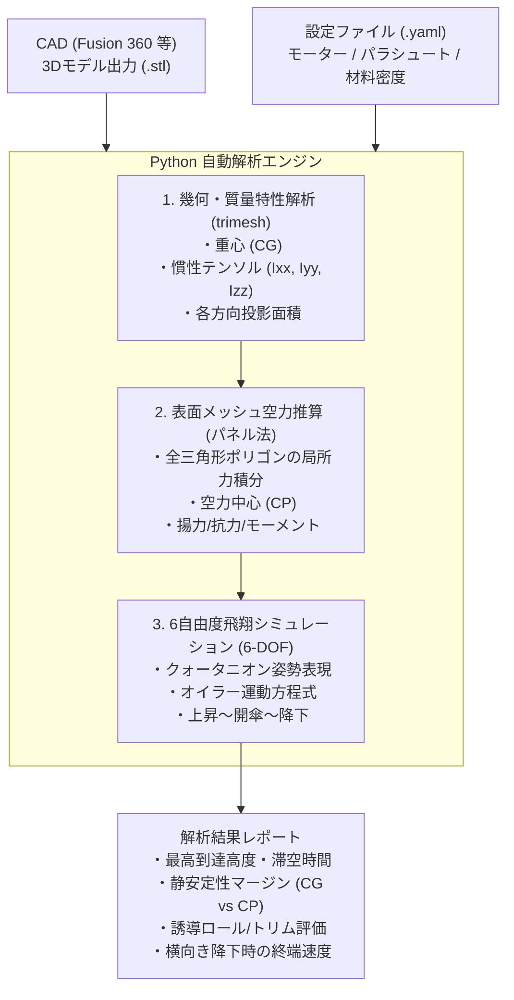

# 3Dモデル直結型 自作ロケットシミュレーター (Rocket Simulator)

## 1. プロジェクトの背景と目的
従来のモデルロケット用シミュレータ（OpenRocketやRockSimなど）は、1960年代のBarrowman法（軸対称な円柱胴体＋平板フィンの足し合わせ近似）に基づいているため、以下のような先進的・変則的な機体設計を評価することができません。

1. **非対称フィン・変則配置**:
   - 4枚中2枚が異なる形状、あるいは12時・3時・9時配置（非等間隔配置）などによる誘導ロール・トリムずれの発生
2. **横向き降下（水平姿勢滞空）ギミック**:
   - パラシュート開傘後に機体を横向きにし、円筒胴体の空気抵抗（$C_d \approx 1.2$）を最大限稼いで滞空時間を延ばす機構
3. **翼胴一体（BWB）・滑らかなフィレット形状**:
   - 翼と胴体の境界が曖昧な形状や、干渉抗力の低減、胴体自体が発生する揚力（CPの前方移動）の評価
4. **CAD試行錯誤の自動化（手入力の排除）**:
   - CADで形状を変更するたびに寸法や数値を手動再入力する手間をなくし、**「STLファイル＋エンジン等の設定」を投入するだけで数秒で全自動解析・レポート出力**を行う環境を実現する

---

## 2. コア設計思想・アプローチ

### なぜ STL なのか？
- **外表面メッシュの抽出が容易**: G-codeのような内部インフィルやサポートパスを排除し、空力計算に必要な「スキン」だけを直接扱える。
- **翼と胴体の区別が不要**: 数千〜数万の三角形ポリゴン全体に対して圧力・摩擦をベクトル積分するため、翼胴一体や変則フィンも丸ごと計算可能。
- **非圧縮性流体領域**: 一般的なモデルロケット（A〜C型、一部D型）の速度域はマッハ0.1〜0.3（150〜350 km/h）程度であり、衝撃波や空気の圧縮性を無視できるため、メッシュベースの簡易空力推算でも実用的な高精度が得られる。

---

## 3. システム構成案・技術スタック

- **言語**: Python 3.10+
- **3Dメッシュ処理**: `trimesh`, `numpy`, `scipy`
  - STLのロード、体積・重心（CG）・慣性モーメントの自動算出
  - 機体軸・横方向の投影面積の計算
- **空力ソルバー**:
  - 局所パネル法（各ポリゴンの法線ベクトルと迎角から局所圧力を積分）
  - $C_L, C_D, C_m, C_l$（ロールモーメント）の算出
  - 迎角・横滑り角に応じた空力中心（CP）の同定
- **飛翔シミュレーション (6-DOF)**:
  - 並進3軸（位置・速度）＋ 回転3軸（姿勢クォータニオン・角速度）
  - モーター推力曲線（.rse / .eng データ対応）
  - 重力、空力、推力、偏心モーメントの連立数値積分（Runge-Kutta 4次等）
  - パラシュート開傘モデル（横向き拘束時の円筒抗力＋傘抗力の合成）
- **既存フレームワーク連携**: 必要に応じて `RocketPy` などの実績あるソルバーの拡張・クラスオーバーライド

---

## 4. 開発ロードマップ案

1. **フェーズ 1: 幾何・質量特性 & 降下滞空時間ツールのプロトタイプ**
   - STLから重心（CG）、慣性テンソル、横向き投影面積を自動抽出
   - パラシュート＋横向き胴体の終端降下速度および滞空時間を算出
2. **フェーズ 2: 表面メッシュ空力推算エンジンの構築**
   - 各迎角における抗力・揚力・ロールトルク・空力中心（CP）の自動推算
   - 静安定性マージン（Caliber）の自動判定
3. **フェーズ 3: 6自由度飛翔シミュレーターの実装**
   - 推力曲線データに基づく上昇フェーズ、頂点（アポジー）検出、開傘シーケンスの結合
4. **フェーズ 4: ワンクリック/自動実行CLI & GUI/レポート生成**
   - YAML設定＋STL投入での自動実行、結果グラフ・サマリーの可視化

---

## 5. 最新の最適化成果 & 解析レポート

- **[非線形パラメトリック翼 最適化解析レポート (docs/NONLINEAR_WING_OPTIMIZATION_REPORT.md)](docs/NONLINEAR_WING_OPTIMIZATION_REPORT.md)**:
  - 単一の一般化べき乗関数モデル $x_{LE} \propto \eta^{p_{le}}, x_{TE} \propto \eta^{p_{te}}$ を導入し、13万通り超の非線形翼を0.004秒で全探索。
  - **4枚十字翼（新・設定B）**: スパン 95mm, 翼根 19mm, 翼端 4.2mm, $p_{le}=0.8, p_{te}=1.6$ $\implies$ **高度 $62.14\,\text{m}$**, **滞空 $14.15\,\text{s}$**, **マージン $+1.01\,\text{cal}$**, **翼重量 $0.92\,\text{g}$**。
  - **3枚非対称 逆Y字35°（新・設定A）**: スパン 100mm, 翼根 34mm, 翼端 2.7mm, $p_{le}=0.8, p_{te}=1.6$ $\implies$ **高度 $60.61\,\text{m}$**, **滞空 $14.13\,\text{s}$**, **マージン $+1.01\,\text{cal}$**, **翼重量 $1.28\,\text{g}$**。
