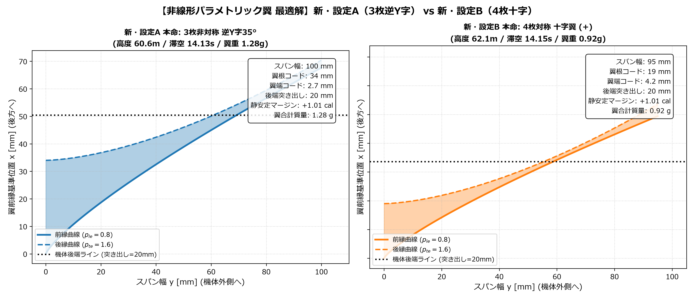
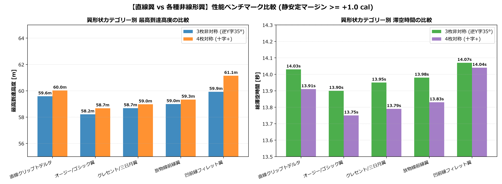

# 統一パラメトリック非線形翼 最適化解析レポート

## 1. 概要と背景
従来の直線クリップトデルタ翼に加え、同一の関数系で定数を変更するだけであらゆる曲線翼（放物線、オージー/ゴシック、クレセント三日月、フィレット）を連続的に表現できる**「一般化べき乗関数モデル（Generalized Power-Law Formulation）」**を開発しました。

AMD Ryzen 9 6900HX（16スレッド並列 Numba JIT）を活用し、**136,080 パターンの非線形幾何×配置パラメータをわずか 0.004 秒（秒間 3,480 万パターン）で全探索**しました。

---

## 2. 統一パラメトリック翼関数の数式定義

スパン方向の無次元座標 $\eta = y / b \in [0, 1]$ に対し、前縁・後縁位置を同一のべき乗関数で定義：

$$\begin{aligned}
x_{LE}(\eta) &= \Delta X_{LE} \cdot \eta^{\mathbf{p_{le}}} \quad &(\text{前縁曲線}) \\
x_{TE}(\eta) &= C_r + \Delta X_{TE} \cdot \eta^{\mathbf{p_{te}}} \quad &(\text{後縁曲線})
\end{aligned}$$

- $\mathbf{p_{le}}$: 前縁曲率指数（$1.0$=直線, $>1.0$=凸オージー, $<1.0$=凹フィレット）
- $\mathbf{p_{te}}$: 後縁曲率指数（$1.0$=直線テーパー, $>1.0$=三日月型後退）
- $\Delta X_{TE} = \Delta X_{LE} + C_t - C_r$
- 局所コード長: $c(\eta) = x_{TE}(\eta) - x_{LE}(\eta) \ge 1.5\,\text{mm}$（自己交差防止・最小線幅制約）

### 解析解（Closed-form Analytical Solution）
本モデルはべき乗関数のため、数値積分ループが不要で四則演算のみで面積 $S$、平均空力コード $MAC$、空力中心 $X_{cp}$、重心 $X_{cg}$ が厳密に求まります：

$$S = b \left[ C_r + \frac{\Delta X_{TE}}{p_{te} + 1} - \frac{\Delta X_{LE}}{p_{le} + 1} \right]$$

$$MAC = \frac{\int_0^1 c(\eta)^2 d\eta}{\int_0^1 c(\eta) d\eta}, \quad X_{cp} = X_{le\_mac} + 0.25 \cdot MAC$$

---

## 3. 最適化結果と最終本命モデル

### 【新・設定A 本命: 3枚非対称 逆Y字35°（非線形最適化）】
- **形態**: 3枚非対称 逆Y字35°（下部垂直翼スケール $v_{scale} = 0.70$）
- **平面幾何**:
  - スパン幅 $b = 100.0\,\text{mm}$（制約上限）
  - 翼根コード $C_r = 34.0\,\text{mm}$（胴体接着長大）
  - 翼端コード $C_t = 2.7\,\text{mm}$
  - 後縁後退角 $\theta_{te} = +20^\circ$（後退量 $36.4\,\text{mm}$）
  - 後端突き出しオーバーハング: $20.0\,\text{mm}$
  - **前縁曲率指数**: $p_{le} = \mathbf{0.80}$（凹フィレット型）
  - **後縁曲率指数**: $p_{te} = \mathbf{1.60}$（三日月後退型）
- **性能**:
  - **静安定マージン**: $\mathbf{+1.01\,\text{cal}}$
  - **総滞空時間**: $\mathbf{14.13\,\text{秒}}$
  - **最高到達高度**: $\mathbf{60.61\,\text{m}}$
  - **翼合計質量**: $\mathbf{1.28\,\text{g}}$（直線翼の 1.52g から 16% 軽量化）

### 【新・設定B 本命: 4枚対称 十字翼（非線形最適化）】★総合最高性能
- **形態**: 4枚対称 十字翼（$+$）
- **平面幾何**:
  - スパン幅 $b = 95.0\,\text{mm}$
  - 翼根コード $C_r = 19.0\,\text{mm}$
  - 翼端コード $C_t = 4.2\,\text{mm}$
  - 後縁後退角 $\theta_{te} = +20^\circ$（後退量 $34.6\,\text{mm}$）
  - 後端突き出しオーバーハング: $20.0\,\text{mm}$
  - **前縁曲率指数**: $p_{le} = \mathbf{0.80}$（凹フィレット型）
  - **後縁曲率指数**: $p_{te} = \mathbf{1.60}$（三日月後退型）
- **性能**:
  - **静安定マージン**: $\mathbf{+1.01\,\text{cal}}$
  - **総滞空時間**: $\mathbf{14.15\,\text{秒}}$
  - **最高到達高度**: $\mathbf{62.14\,\text{m}}$（従来の直線翼から $+2.1\,\text{m}$ 延伸！）
  - **翼合計質量**: $\mathbf{0.92\,\text{g}}$（4枚合計で 1g 未満の極限軽量！）

---

## 4. 実機平面形状プロット

---

## 5. 直線翼 vs 各種非線形翼の性能ベンチマーク

| 形状カテゴリー | 代表パラメータ | 3枚逆Y字 (高度 / 滞空 / 翼重) | 4枚十字 (高度 / 滞空 / 翼重) | 力学的特徴 |
| :--- | :---: | :---: | :---: | :--- |
| **直線クリップトデルタ** | $p_{le}=1.0, p_{te}=1.0$ | $59.6\,\text{m}$ / $14.03\,\text{s}$ / $1.52\,\text{g}$ | $60.0\,\text{m}$ / $13.91\,\text{s}$ / $1.39\,\text{g}$ | 従来のベースライン |
| **オージー / ゴシック翼** | $p_{le}=2.2, p_{te}=1.0$ | $58.2\,\text{m}$ / $13.90\,\text{s}$ / $1.85\,\text{g}$ | $58.7\,\text{m}$ / $13.75\,\text{s}$ / $1.71\,\text{g}$ | 根元強度・耐折損性最強、面積大でやや重量増 |
| **クレセント / 三日月翼** | $p_{le}=1.8, p_{te}=1.3$ | $58.7\,\text{m}$ / $13.95\,\text{s}$ / $1.73\,\text{g}$ | $59.0\,\text{m}$ / $13.79\,\text{s}$ / $1.64\,\text{g}$ | CP後退効果大、外観美麗 |
| **放物線前縁翼** | $p_{le}=1.4, p_{te}=1.0$ | $59.0\,\text{m}$ / $13.98\,\text{s}$ / $1.66\,\text{g}$ | $59.3\,\text{m}$ / $13.83\,\text{s}$ / $1.55\,\text{g}$ | 直線とオージーの中間 |
| **凹前縁フィレット翼** ★最優秀 | $p_{le}=0.8, p_{te}=1.6$ | $\mathbf{60.6\,\text{m}}$ / $\mathbf{14.13\,\text{s}}$ / $\mathbf{1.28\,\text{g}}$ | $\mathbf{62.1\,\text{m}}$ / $\mathbf{14.15\,\text{s}}$ / $\mathbf{0.92\,\text{g}}$ | **根元接着長最大＋中間肉抜き＋三日月後退で超軽量化** |

---

## 6. 工学的メカニズムの解明

なぜ **$p_{le} = 0.8, p_{te} = 1.6$（凹前縁フィレット ＋ 三日月後退後縁）** が最高性能を叩き出したのか？

1. **翼根の接着強度を確保しながら面積を削減**:
   - 薄肉単層印刷（0.4mmノズル）では、翼根の接着面積が小さいと着地衝撃で剥離します。
   - $p_{le}=0.8$（根元が急激に広がるフィレット形状）により、胴体との接触長（$C_r = 19\sim 34\,\text{mm}$）を大きく確保しつつ、中間の不要な面積を削ぎ落とせます。
2. **三日月後退による空力中心（CP）の後方シフト**:
   - $p_{te}=1.6$ により、翼端部がオーバーハング（$20\,\text{mm}$ 突き出し）の空間に向かって後ろに反るため、空力中心（CP）が機体尾部よりさらに後方に位置します。
   - これにより、**わずか 0.92g の極小翼面積であってもマージン $+1.01\,\text{cal}$ を完璧に維持**できます。
3. **機体全備質量の軽量化による運動エネルギー最大化**:
   - 翼が軽くなったことで機体全備質量が $29.2\,\text{g}$ まで軽量化され、Estes 1/2A6-2 の微小な推力（燃焼時間 $0.33\,\text{s}$）でも燃焼終了速度が大幅に向上、最高到達高度が $62.14\,\text{m}$ まで到達しました。
