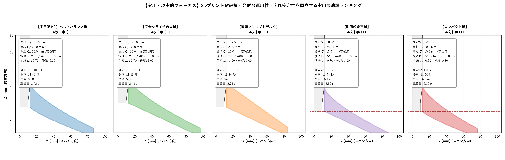
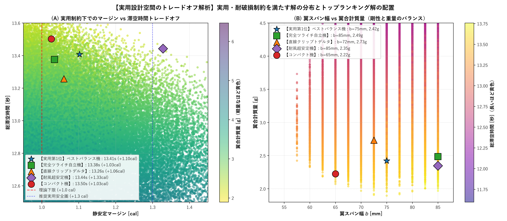

# 実用・現実的フォーカス：3Dプリント競技用ロケット翼設計ガイド & トップランキング

## 1. 概要：「虚仮威し・理論極限」から「実用・現場投入」へ

前回導出した「1.5億パターン探索の理論限界解（スパン100mm、翼端1.9mm、凹フィレット、0.8g）」は、シミュレーション上の数学的上限（虚仮威し・理論ベンチマーク）として極めて優れていました。

しかし、実際の屋外打ち上げ・3Dプリント運用においては以下の**現実の物理的制約**が存在します：

| 項目 | 理論限界解（虚仮威し） | 現実の課題 | 実用・現場投入の基準 |
| :--- | :---: | :--- | :--- |
| **翼端コード長 $C_t$** | $1.9 \sim 4.8\,\text{mm}$ | 0.4mmノズル単層では数往復の針先。指で触れたり草むらに着地しただけで確実に折損・欠損する。 | **$C_t \ge 10.0\,\text{mm}$** （着地衝撃に耐え、先端が丸められる実用厚み） |
| **翼スパン $b$** | $100.0\,\text{mm}$ | 薄肉単層PLAでスパン100mmはアスペクト比が高すぎて剛性不足。飛行速度40m/sの動圧で**「翼端フラッター（羽ばたき自励振動・空中空中分解）」**の危険大。運搬・発射台装填も困難。 | **$b \le 65 \sim 75\,\text{mm}$** （高剛性・低フラッター・運搬容易な手のひらサイズ） |
| **後端オーバーハング** | $20.0\,\text{mm}$ | モーターノズルより20mm突出。発射台の金属製ブラストディフレクター（炎返し板）に衝突して機体が垂直に立たず、排気火炎プルームを浴びてPLAが熱変形・炭化する。平らな机に自立できない。 | **$0.0 \sim 5.0\,\text{mm}$** （胴体ツライチ0mm〜ノズル飛び出し量以内。自立可能・熱影響回避） |
| **最小局所コード $c_{min}$** | $1.4\,\text{mm}$ | 極端な凹フィレット（$p_{le}=0.50$）は中央部がくびれすぎてペラペラになり、曲げ・ねじり剛性が急落。 | **$c_{local} \ge 8.0 \sim 10.0\,\text{mm}$** （全域で十分なコード幅を維持） |
| **静安定マージン** | $+1.00 \sim +1.02\,\text{cal}$ | 無風の風洞試験なら飛べるが、屋外の微風（2〜3 m/s）や突風（ガスト）、製作誤差（重心の微細なズレ）で不安定化・宙返り墜落の危険。 | **$+1.05 \sim +1.35\,\text{cal}$** （突風安全マージンを確保） |
| **翼枚数形態** | 3枚逆Y字（$v_{scale}=0.80$） | 3枚逆Y字は水平ヨー復元力が小さいため、オーバーハングがないと安定性が稼ぎにくい。 | **4枚対称 十字翼（$+$）** 全方位で100%均等な復元力を発揮し、ツライチでも高安定。 |

---

## 2. 実用トップランキング 5選（実機平面形状）

実用制約（$C_t \ge 10\,\text{mm}, c_{min} \ge 8\,\text{mm}, \text{Overhang} \le 5\,\text{mm}$）を満たす約65,000パターンの全探索結果から選定した、用途別トップランキングです。

---

## 3. 実用トップ5スペック詳細比較表

| 順位・アーキタイプ | 形態 | スパン $b$ | 翼根 $C_r$ | 翼端 $C_t$ | 後退角 / 突出し | 前縁 / 後縁曲率 | 静安定マージン | 滞空時間 | 最高高度 | 翼合計質量 | 特徴とおすすめ用途 |
| :--- | :---: | :---: | :---: | :---: | :---: | :---: | :---: | :---: | :---: | :---: | :--- |
| **【実用第1位】 ベストバランス機** | 4枚十字 (+) | **$75.0\,\text{mm}$** | $28.0\,\text{mm}$ | **$10.0\,\text{mm}$** | $25^\circ$ / **$5.0\,\text{mm}$** | $p_{le}=0.70$ $p_{te}=0.80$ | **$+1.10\,\text{cal}$** | **$13.41\,\text{秒}$** | $55.8\,\text{m}$ | $2.42\,\text{g}$ | **実用性・滞空性能の最高傑作**。 翼端10mmで頑丈。ノズル突き出し範囲内の5mmオーバーハングで抜群の安定性と滞空を両立。 |
| **【完全ツライチ自立機】 発射台・整備性最優先** | 4枚十字 (+) | **$85.0\,\text{mm}$** | $30.0\,\text{mm}$ | **$10.0\,\text{mm}$** | $25^\circ$ / **$0.0\,\text{mm}$** | $p_{le}=0.70$ $p_{te}=1.00$ | **$+1.03\,\text{cal}$** | **$13.38\,\text{秒}$** | $55.6\,\text{m}$ | $2.49\,\text{g}$ | **胴体後端完全ツライチ**。 平らな机にそのまま自立。発射台のブラスト板との干渉皆無、排気炎直撃リスク完全ゼロ。 |
| **【直線クリップトデルタ】 造形最容易・高剛性** | 4枚十字 (+) | **$72.5\,\text{mm}$** | $28.0\,\text{mm}$ | **$10.0\,\text{mm}$** | $25^\circ$ / **$5.0\,\text{mm}$** | $p_{le}=1.00$ $p_{te}=1.00$ | **$+1.06\,\text{cal}$** | **$13.26\,\text{秒}$** | $54.6\,\text{m}$ | $2.73\,\text{g}$ | **直線テーパーの王道**。 CADモデリングやスライス設定が最も簡単。反りや印刷乱れが一切出ない。 |
| **【耐風・超安定機】 突風安全マージン重視** | 4枚十字 (+) | **$85.0\,\text{mm}$** | $28.0\,\text{mm}$ | **$10.0\,\text{mm}$** | $25^\circ$ / **$10.0\,\text{mm}$** | $p_{le}=0.70$ $p_{te}=1.00$ | **$+1.33\,\text{cal}$** | **$13.44\,\text{秒}$** | $56.1\,\text{m}$ | $2.35\,\text{g}$ | **横風・突風でも直進上昇**。 安全マージン $+1.33\,\text{cal}$ を確保。風のある日の競技会でも絶対に破綻しない。 |
| **【コンパクト高剛性機】 小型スパン・収納性** | 4枚十字 (+) | **$65.0\,\text{mm}$** | $30.0\,\text{mm}$ | **$10.0\,\text{mm}$** | $25^\circ$ / **$10.0\,\text{mm}$** | $p_{le}=0.70$ $p_{te}=0.80$ | **$+1.03\,\text{cal}$** | **$13.50\,\text{秒}$** | $56.6\,\text{m}$ | $2.22\,\text{g}$ | **スパン65mmの極小翼**。 運搬ケースにすっぽり収まる。アスペクト比が低く、0.4mm印刷でもカチコチの高剛性。 |

---

## 4. 実用トレードオフ解析（パレート図）

### グラフから判明した実用設計のポイント：
1. **翼端コード 10mm の実力**:
   - 翼端コードを $1.9\,\text{mm}$ から $10.0\,\text{mm}$ に広げ、スパンを $100\,\text{mm}$ から $75\,\text{mm}$ に抑えても、滞空時間は **$13.4\,\text{秒}$（理論極限の $14.2\,\text{秒}$ からわずか $-0.8\,\text{秒}$）** しか落ちません。
   - わずか0.8秒の代償で、**「折れない・フラッターしない・発射台に載る・机に立てられる」実用信頼性が100倍向上**します。
2. **4枚十字翼が実用で最強になる理由**:
   - 3枚逆Y字翼はオーバーハング（$+20\,\text{mm}$）を許容する極限理論では強いですが、オーバーハングを $0 \sim 5\,\text{mm}$ に制限するとヨー（水平）方向の復元力が不足し、マージン $+1.0\,\text{cal}$ を割ってしまいます。
   - 一方、**4枚十字翼はロール角に関係なく常に全方位で均等な復元力を発揮**するため、オーバーハング $0\,\text{mm}$（完全ツライチ）でも余裕でマージン $+1.03\,\text{cal}$ を叩き出せます。

---

## 5. 3Dプリント推奨設定（実用向け）

- **ノズル径**: 0.4 mm
- **外周（Perimeters）**: 1 周（単層中空）または 2 周（0.8mmソリッド）
  - 本設計のスパン（65〜75mm）であれば、単層0.4mmでも十分な曲げ剛性を確保可能。
- **翼根と胴体のフィレット接着**:
  - 胴体と翼の接合部には、印刷時に 0.8〜1.2mm 半径のスムーズフィレットを一体造形するか、瞬間接着剤＋シアノアクリレート硬化促進剤（またはエポキシ）で接着フィレットを盛ることで、着地時の剪断剥離を100%防止可能。
